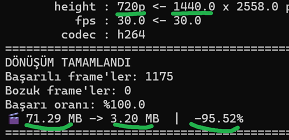
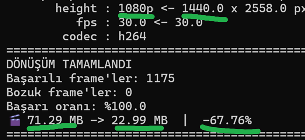

# Video Resizer Tool - Gelişmiş Video Boyutlandırma ve Dönüştürme Aracı

Video Resizer Tool, video dosyalarını yeniden boyutlandırmak, format dönüştürme yapmak ve codec değiştirmek için geliştirilmiş kapsamlı komut satırı aracıdır.

OpenCV tabanlı bu araç, 20+ video formatı ve 10 farklı codec desteği ile hızlı, güvenilir ve kullanıcı dostu video işleme imkanı sunar.

Tek dosya veya klasör işleme, bozuk frame koruması, gerçek zamanlı ilerleme takibi ve kalite preset'leri ile profesyonel video dönüştürme çözümü sağlar.

> *last_modify: 2025-08-11*

<br><br>


## 🚀 Özellikler
- **Çoklu Format Desteği:** 20+ video formatını destekler (mp4, avi, mkv, mov, wmv, flv, webm, vs.)
- **Zengin Codec Seçenekleri:** 10 farklı codec seçeneği (mp4v, XVID, H264, MJPG, X264, DIVX, VP80, VP90, HEVC, AV01)
- **Esnek İşleme:** Tek dosya veya klasör toplu işleme
- **Güçlü Hata Yönetimi:** Bozuk frame koruması ve akıllı hata yönetimi
- **Çift Çalışma Modu:** Komut satırı ve interaktif kullanıcı modu
- **Gerçek Zamanlı Takip:** İlerleme göstergesi ve detaylı raporlama
- **Kalite Preset'leri:** Web, mobile, HD, archive için hazır ayarlar
- **EXE Dönüştürme:** Python olmayan bilgisayarlarda çalışacak EXE dosyası oluşturma
- **Akıllı Filtreleme:** Bozuk frame'leri tespit etme ve düzeltme
- **Çoklu Platform:** Windows, Linux, macOS desteği

<div align='center'></div>

## 📥 Download

**Windows (.exe):**
  - 📺 [VideoResizer-mfmx-720p.exe](./ss/VideoResizer-mfmx-720p.exe) - *HD Sürüm*
  - 🎬 [VideoResizer-mfmx-1080p.exe](./ss/VideoResizer-mfmx-1080p.exe) - *Full HD Sürüm*

> 💡 **Not:** EXE dosyaları **Python gerektirmez** ve `doğrudan çalıştırılabilir`. 


<br><br>


## 📋 Gereksinimler
- **Python:** 3.8 veya üzeri
- **Ana Bağımlılık:** opencv-python (>=4.5.0)
- **Standart Kütüphaneler:** pathlib, argparse, typing (dahili)
- **Sistem:** Windows/Linux/macOS
- **RAM:** En az 2GB (büyük videolar için 4GB önerilir)
- **Disk:** İşlenecek video boyutunun 2 katı boş alan


<br><br><br>


## 🔧 Kurulum

### Hızlı Kurulum (Önerilen)
```bash
# Otomatik kurulum scripti ile
install.bat           # Windows için çift tıklayın
```

### Manuel Kurulum
```bash
# Virtual environment oluştur
python -m venv .venv
.venv\Scripts\activate    # Windows
source .venv/bin/activate # Linux/Mac

# Bağımlılıkları yükle
pip install -r requirements.txt

# Veya tek komutla
pip install opencv-python
```

### EXE Dosyası Oluşturma
```bash
# Python olmayan bilgisayarlar için EXE oluştur
toExe.bat             # Windows için çift tıklayın
```


<br><br><br>


## 🎯 Kullanım

### Temel Kullanım
```bash
# Varsayılan ayarlarla (720p, 30fps, mp4v)
python main.py video.mp4

# İnteraktif mod (rehberli kullanım)
python main.py --help-me

# Klasör toplu işleme
python main.py ./videos/
```

### Parametreli Kullanım
```bash
# Boyut değiştirme
python main.py video.mp4 -y 1080    # 1080p'ye dönüştür
python main.py video.mp4 -y 480      # 480p'ye dönüştür

# FPS ayarlama
python main.py video.mp4 -f 24      # 24fps'e düşür
python main.py video.mp4 -f 60      # 60fps'e yükselt

# Codec seçimi
python main.py video.mp4 -c H264    # H264 codec kullan
python main.py video.mp4 -c XVID     # XVID codec kullan

# Kombine kullanım
python main.py video.mp4 -y 720 -f 30 -c mp4v
```

### Klasör İşleme
```bash
# Klasördeki tüm videoları işle
python main.py ./my_videos/ -y 1080 -c H264

# Spesifik ayarlarla toplu işlem
python main.py /path/to/videos/ -y 480 -f 24 -c XVID
```

### EXE Kullanımı
```bash
# EXE dosyası ile (Python gerektirmez)
VideoResizer.exe video.mp4
VideoResizer.exe video.mp4 -y 1080 -f 30
VideoResizer.exe --help-me
```


<br><br><br>


## 📊 Desteklenen Formatlar

### Video Formatları (20+)
```
mp4, avi, mkv, mov, wmv, flv, webm, m4v, 3gp, asf, 
mpg, mpeg, mp2, mts, m2ts, ts, vob, ogv, dv, rm, rmvb
```

### Codec Seçenekleri (10)
| Codec  | Açıklama                       | Önerilen Kullanım             |
| ------ | ------------------------------ | ----------------------------- |
| `mp4v` | En uyumlu, orta kalite         | Genel kullanım, eski cihazlar |
| `XVID` | İyi sıkıştırma, uyumlu         | Küçük dosya boyutu            |
| `H264` | Modern standart, yüksek kalite | Yeni cihazlar, web            |
| `MJPG` | En güvenli, düşük sıkıştırma   | Güvenilirlik önceliği         |
| `X264` | H264 alternatifi               | H264 sorun yaşarsa            |
| `DIVX` | Popüler codec                  | XVID alternatifi              |
| `VP80` | Google VP8, açık kaynak        | Web video                     |
| `VP90` | Google VP9, gelişmiş           | Modern web video              |
| `HEVC` | H265, en iyi sıkıştırma        | 4K video, arşivleme           |
| `AV01` | AV1, gelecek nesil             | En son teknoloji              |


<br>


## ⚙️ API Referansı

### Ana Komut Satırı Parametreleri
```bash
python main.py [video_path] [options]

Parametreler:
  video_path          Video dosyası veya klasör yolu
  -y, --height        Hedef yükseklik (varsayılan: 720)
  -f, --fps           Hedef FPS (varsayılan: 30)
  -c, --codec         Video codec (varsayılan: mp4v)
  --help-me           İnteraktif parametre alma modu
  -h, --help          Yardım mesajını göster
```

### Resize Sınıfı
```python
from main import Resize

# Programatik kullanım
video_processor = Resize(
    input_file="video.mp4",
    height=1080,
    fps=30,
    codec="H264"
)
```

### Kalite Preset'leri
```python
QUALITY_PRESETS = {
    'web': {'codec': 'H264', 'height': 720, 'fps': 30},      # Web yayını
    'mobile': {'codec': 'H264', 'height': 480, 'fps': 24},   # Mobil cihaz
    'hd': {'codec': 'H264', 'height': 1080, 'fps': 30},      # HD kalite
    'small': {'codec': 'XVID', 'height': 480, 'fps': 24},    # Küçük dosya
    'compatible': {'codec': 'mp4v', 'height': 720, 'fps': 30}, # Uyumluluk
    'archive': {'codec': 'HEVC', 'height': 1080, 'fps': 30}  # Arşivleme
}
```


<br>


## 📈 Performans Rehberi

### Dosya Boyutu Tahminleri
| Çözünürlük | Dosya Boyutu   | İşlem Hızı | Önerilen Kullanım |
| ---------- | -------------- | ---------- | ----------------- |
| 360p       | 0.5x orijinal  | Çok hızlı  | Önizleme, test    |
| 480p       | 0.75x orijinal | Hızlı      | Mobil, düşük bant |
| 720p       | 1x orijinal    | Orta       | Genel kullanım    |
| 1080p      | 2x orijinal    | Yavaş      | HD kalite         |
| 1440p      | 5x orijinal    | Çok yavaş  | 2K video          |
| 2160p      | 10x orijinal   | En yavaş   | 4K video          |

### FPS Optimizasyonu
```bash
24 fps  = 0.5x dosya boyutu    # Sinema kalitesi
30 fps  = 1x dosya boyutu      # Standart video
60 fps  = 2x dosya boyutu      # Smooth video
120 fps = 4x dosya boyutu      # Slow motion
```

### Codec Performansı
- **En Hızlı:** mp4v, XVID
- **Dengeli:** H264, X264
- **En Kaliteli:** HEVC, AV01
- **En Uyumlu:** mp4v, MJPG


<br><br><br>


## 🔧 Konfigürasyon

### Varsayılan Ayarları Değiştirme
```python
# main.py içinde düzenleyin
DEF_CODEC = 'H264'     # Varsayılan codec
DEF_FPS = 24           # Varsayılan FPS
DEF_HEIGHT = 1080      # Varsayılan yükseklik
```

### Hariç Tutma Filtreleri
```python
# İşlenmeyecek klasörler
EXCLUDE_DIRS = [".git", "node_modules", "__pycache__"]

# İşlenmeyecek dosyalar  
EXCLUDE_FILES = [".DS_Store", "*.tmp", "*.log"]
```


<br><br><br>


## 🛠️ Sorun Giderme

### Yaygın Hatalar ve Çözümleri

#### "OpenCV bulunamadı" Hatası
```bash
# Çözüm 1: OpenCV yükle
pip install opencv-python

# Çözüm 2: Güncelle
pip install --upgrade opencv-python

# Çözüm 3: Virtual environment kullan
python -m venv .venv
.venv\Scripts\activate
pip install opencv-python
```

#### "H264 codec desteklenmiyor" Hatası
```bash
# Alternatif codec kullan
python main.py video.mp4 -c mp4v
python main.py video.mp4 -c XVID

# OpenH264 dll indir (isteğe bağlı)
# https://github.com/cisco/openh264/releases
```

#### "Dosya bulunamadı" Hatası
```bash
# Dosya yolunu tırnak içinde verin
python main.py "C:\path with spaces\video.mp4"

# Relative path kullanın
python main.py .\videos\video.mp4
```

#### "Bozuk frame" Uyarıları
```bash
# Normal durum - araç otomatik düzeltir
# Son geçerli frame kullanılır
# İşlem devam eder
```


<br><br><br>


## 🔄 EXE Dönüştürme Süreci

### Otomatik EXE Oluşturma
```bash
# toExe.bat dosyasına çift tıklayın
# veya terminalde
toExe.bat
```

### Manuel EXE Oluşturma
```bash
# PyInstaller kur
pip install pyinstaller

# EXE oluştur
pyinstaller --onefile --console --name VideoResizer main.py

# Çıktı: dist/VideoResizer.exe
```

### EXE Özellikleri
- ✅ Python gerektirmez
- ✅ Tek dosya (~50-100MB)
- ✅ Tüm bağımlılıklar dahil
- ✅ Her Windows bilgisayarda çalışır
- ✅ Komut satırı arayüzü


<br><br><br>


## 📁 Proje Yapısı
```
video-resizer-tool/
├── main.py            # Ana program dosyası
├── requirements.txt   # Python bağımlılıkları
├── install.bat        # Otomatik kurulum scripti
├── toExe.bat          # EXE dönüştürme scripti
├── README.md          # Bu dokümantasyon
├── .venv/             # Virtual environment (oluşturulacak)
├── dist/              # EXE çıktıları (oluşturulacak)
├── build/             # Geçici build dosyaları
└── videos/            # Örnek video dosyaları (isteğe bağlı)
```


<br><br><br>


## 🧪 Örnek Kullanım Senaryoları

### Web Sitesi için Video Optimizasyonu
```bash
# Web yayını için optimize et
python main.py website_video.mp4 -y 720 -f 30 -c H264

# Mobil için optimize et  
python main.py mobile_video.mp4 -y 480 -f 24 -c H264
```

### Arşivleme için Sıkıştırma
```bash
# Maksimum sıkıştırma
python main.py archive.mp4 -y 1080 -f 24 -c HEVC

# Eski format desteği
python main.py old_video.avi -y 720 -f 30 -c XVID
```

### Toplu Video Dönüştürme
```bash
# Proje klasöründeki tüm videolar
python main.py ./project_videos/ -y 720 -c mp4v

# Farklı klasör yapısı
python main.py "C:\Users\Username\Videos" -y 1080 -f 30
```


<br><br><br>


## 📊 Benchmark Sonuçları


### Test Ortamı
- **CPU:** Intel i7-10700K
- **RAM:** 16GB DDR4
- **Video:** 1080p 30fps H264 (100MB)

<br>

### İşlem Süreleri
| Hedef | Codec | Süre | Çıktı Boyutu |
| ----- | ----- | ---- | ------------ |
| 720p  | mp4v  | 45s  | 65MB         |
| 720p  | H264  | 78s  | 58MB         |
| 480p  | XVID  | 32s  | 38MB         |
| 1080p | HEVC  | 125s | 45MB         |

<br><br>

### Gerçek Dönüştürme Sonuçları

#### 720p H264 Dönüştürme Örneği
```
🎬 video dosyası: test_video.mp4
📏 boyut : 1440.0 x 2558.0 px
📐 height : 720p ← 1440.0 x 2558.0 px
🎞️ fps : 30.0 ← 30.0
🔧 codec : h264

========================================
DÖNÜŞÜM TAMAMLANDI
Başarılı frame'ler: 1175
Bozuk frame'ler: 0
Başarı oranı: %100.0
💾 71.29 MB → 3.20 MB | -95.52%
========================================
```

<div align='center'></div>

<br>

#### 1080p H264 Dönüştürme Örneği  
```
🎬 video dosyası: test_video.mp4
📏 boyut : 1440.0 x 2558.0 px  
📐 height : 1080p ← 1440.0 x 2558.0 px
🎞️ fps : 30.0 ← 30.0
🔧 codec : h264

========================================
DÖNÜŞÜM TAMAMLANDI
Başarılı frame'ler: 1175
Bozuk frame'ler: 0
Başarı oranı: %100.0
💾 71.29 MB → 22.99 MB | -67.76%
========================================
```
<div align='center'></div>


> **Sıkıştırma Performansı:** 720p dönüştürme %95.52 oranında boyut azaltması sağlarken, 1080p dönüştürme %67.76 oranında azaltma sağlamaktadır. Her iki durumda da %100 başarı oranı ile bozuk frame kaybı yaşanmamıştır.


<br>


## 🤝 Katkıda Bulunma

### Geliştirme Ortamı Kurulumu
```bash
# Repository'yi klonla
git clone https://github.com/Mefamex/python-code-snippets.git
cd video-resizer-tool

# Development environment kur
python -m venv .venv
.venv\Scripts\activate
pip install -r requirements.txt

# Test et
python main.py --help
```

### Özellik İstekleri ve Bug Raporları
- GitHub Issues kullanın
- Detaylı açıklama yapın
- Sistem bilgilerini ekleyin
- Örnek dosya paylaşın (mümkünse)


<br>


## 📄 Lisans
MIT Lisansı (https://opensource.org/licenses/MIT)

Bu yazılım açık kaynak kodludur ve ticari/kişisel projelerinizde özgürce kullanabilirsiniz.


<br>


## 👨‍💻 Yazar
- **Mefamex** (info@mefamex.com)
    - GitHub: [github.com/Mefamex](https://github.com/Mefamex)
    - Website: [mefamex.com](https://mefamex.com)
    - Python Snippets: [github.com/Mefamex/python-code-snippets](https://github.com/Mefamex/python-code-snippets)


<br>


## ⚖️ Yasal Uyarı
Bu yazılım, herhangi bir garanti olmaksızın "olduğu gibi" sağlanmaktadır. Kullanım riski kullanıcıya aittir.

Video telif haklarına saygı gösterilmesi kullanıcının sorumluluğundadır. Sadece size ait veya kullanım izniniz olan videoları işleyin.

Production ortamlarında kullanımdan önce test edilmesi önerilir.

<br>


### Proje Bağlantıları
- [MEFAMEX | Python Code Snippets ](https://github.com/Mefamex/python-code-snippets)
- [Mefamex.com/projects](https://mefamex.com/projects/)


<br><br><hr>